# JBS Mechanical & Engineering Pte Ltd - Organization Chart

## Company Structure

```mermaid
flowchart TD
    %% ===========================================
    %% BOARD OF DIRECTORS LEVEL
    %% ===========================================
    MD["`🏢 **Mr. WIN MYINT**
    Managing Director`"]
    
    %% ===========================================
    %% EXECUTIVE LEVEL (C-Suite & Directors)
    %% ===========================================
    BDE["`💼 **MR. ANOWER HOSSION**
    Business Development Executive`"]
    SH["`👥 **MD AHAD KHAN**
    Shareholder`"]
    
    %% ===========================================
    %% DEPARTMENT HEADS & MANAGERS
    %% ===========================================
    ACC["`💰 **Mr. Thein Tun Aung@Donally**
    Chief Accountant`"]
    ADM["`🏛️ **NATARAJAN ANBAZHAGAN**
    Admin Manager`"]
    WSH["`🛡️ **MR. C. JAYARAMAN**
    WSHC Safety Coordinator`"]
    SC["`⚠️ **MD SHAKIL HOSSAIN**
    Safety Co-Ordinator`"]
    
    %% ===========================================
    %% SUPERVISORS & PROJECT MANAGERS
    %% ===========================================
    MS["`🔧 **MR. NYI NYI TUN**
    Mechanical Supervisor`"]
    PS["`🔩 **MR. NAING LIN**
    Piping Supervisor`"]
    PM["`⚡ **MR. RANJITH**
    Electrical Project Manager`"]
    
    %% ===========================================
    %% OPERATIONAL TEAMS
    %% ===========================================
    MECHTEAM["`🔨 **Mechanical Team** (8 members)
    ────────────────────────
    • MR. JAHANGIR ALAM
    • MR. THAN SWE
    • MR. ROKUNUL ISLAM
    • MR. ABDUL KADER
    • MR. MOHIUDDIN
    • MR. SAIFUL ISLAM
    • MR. AMINUL ISLAM
    • MR. RASHIDUL ISLAM`"]
    
    WELDTEAM["`🔥 **Welding Team** (8 members)
    ────────────────────────
    • MR. GOVINDA
    • MR. MIA MANIR
    • MR. MIA ROY
    • MR. ABDUL HALIM
    • MR. MIZANUR RAHMAN
    • MR. SHAHIDUL ISLAM
    • MR. MOTIUR RAHMAN
    • MR. NURUL ISLAM`"]
    
    PIPETEAM["`🚰 **Piping Team** (7 members)
    ────────────────────────
    • MR. SHAFIKUL ISLAM
    • MR. MONIR HOSSAIN
    • MR. BILLAL HOSSAIN
    • MR. JASIM UDDIN
    • MR. DELWAR HOSSAIN
    • MR. ABDUL MANNAN
    • MR. RAFIQUL ISLAM`"]
    
    ELECTEAM["`⚡ **Electrical Team** (4 members)
    ────────────────────────
    • MR. POOVIDARAN
    • MR. ARUNKUMAR
    • MR. SELVAM
    • MR. GANESH`"]
    
    SAFETEAM["`🦺 **Safety Team** (3 members)
    ────────────────────────
    • MR. SABARINATHAN
    • MR. KUMAR SELVAN
    • MR. RAVI SHANKAR`"]
    
    LOGITEAM["`🚛 **Logistics Team** (4 members)
    ────────────────────────
    • MR. PALANI
    • MR. SOLARAJ
    • MR. MURUGAN
    • MR. KRISHNAN`"]
    
    INSULTEAM["`🏠 **Insulation Team** (3 members)
    ────────────────────────
    • MR. SHIU
    • MR. WONG
    • MR. LIM`"]
    
    %% ===========================================
    %% ORGANIZATIONAL HIERARCHY
    %% ===========================================
    
    %% Board Level
    MD --> BDE
    MD --> SH
    
    %% Executive Level Reports to MD
    MD --> ACC
    MD --> ADM
    BDE --> WSH
    BDE --> SC
    
    %% Department Heads Report to Executives
    ADM --> MS
    ADM --> PS
    BDE --> PM
    
    %% Teams Report to Supervisors/Managers
    MS --> MECHTEAM
    MS --> WELDTEAM
    PS --> PIPETEAM
    PM --> ELECTEAM
    WSH --> SAFETEAM
    SC --> SAFETEAM
    ADM --> LOGITEAM
    ACC --> INSULTEAM
    
    %% ===========================================
    %% ADVANCED STYLING
    %% ===========================================
    
    %% Board of Directors (Top Tier)
    classDef ceo fill:#1a1a2e,stroke:#16213e,stroke-width:4px,color:#fff,font-weight:bold,font-size:16px,border-radius:15px
    
    %% Executive Level (C-Suite)
    classDef executive fill:#16537e,stroke:#0f3460,stroke-width:3px,color:#fff,font-weight:bold,font-size:14px,border-radius:12px
    
    %% Department Heads & Managers
    classDef manager fill:#1e88e5,stroke:#1565c0,stroke-width:2px,color:#fff,font-weight:bold,font-size:13px,border-radius:10px
    
    %% Supervisors
    classDef supervisor fill:#43a047,stroke:#2e7d32,stroke-width:2px,color:#fff,font-weight:bold,font-size:12px,border-radius:8px
    
    %% Operational Teams
    classDef team fill:#7cb342,stroke:#558b2f,stroke-width:2px,color:#fff,font-size:11px,border-radius:8px
    
    %% Support Teams
    classDef support fill:#fb8c00,stroke:#ef6c00,stroke-width:2px,color:#fff,font-size:11px,border-radius:8px
    
    %% Apply Styles
    class MD ceo
    class BDE,SH executive
    class ACC,ADM,WSH,SC manager
    class MS,PS,PM supervisor
    class MECHTEAM,WELDTEAM,PIPETEAM,ELECTEAM,SAFETEAM team
    class LOGITEAM,INSULTEAM support
```

## Department Overview

### **Board of Directors**
- **Managing Director**: Mr. WIN MYINT (H/p: 9237 1739)
- **Business Development Executive**: MR. ANOWER HOSSION (HP: 9353 2674)
- **Shareholder**: MD AHAD KHAN

### **Key Executives**
- **Accountant**: Mr. Thein Tun Aung@Donally (H/p: 93961662)
- **Admin**: NATARAJAN ANBAZHAGAN (H/p: 93452513)

### **Department Structure**

#### **Safety Department**
- **WSHC Safety Coordinator**: MR. C. JAYARAMAN
- **Safety Co-Ordinator**: MD SHAKIL HOSSAIN
- **Team**: MR. SABARINATHAN, MR. KUMAR SELVAN, MR. RAVI SHANKAR

#### **Mechanical Department**
- **Supervisor**: MR. NYI NYI TUN
- **Team (8 members)**: Mechanical technicians and welders

#### **Piping Department**
- **Supervisor**: MR. NAING LIN
- **Team (7 members)**: Pipe fitters and specialists

#### **Electrical Department**
- **Project Manager**: MR. RANJITH
- **Team (4 members)**: Electricians and electrical specialists

#### **Support Departments**
- **Logistics Team (4 members)**: Drivers and transport
- **Insulation Team (3 members)**: Insulation specialists

---

## Company Contact Information
- **Phone**: +65 9353 2674, +65 6561 6934, +65 9337 7831 (Mr Ravi)
- **Email**: jbsmechanical56@gmail.com
- **Address**: Eco-Tech@Sunview, 1 Sunview Road, #02-38/39, Singapore 627615

---

*Organization chart for JBS Mechanical & Engineering Pte Ltd - Your trusted partner for plant maintenance, shutdown works, and comprehensive industrial solutions in Singapore's process industry.*